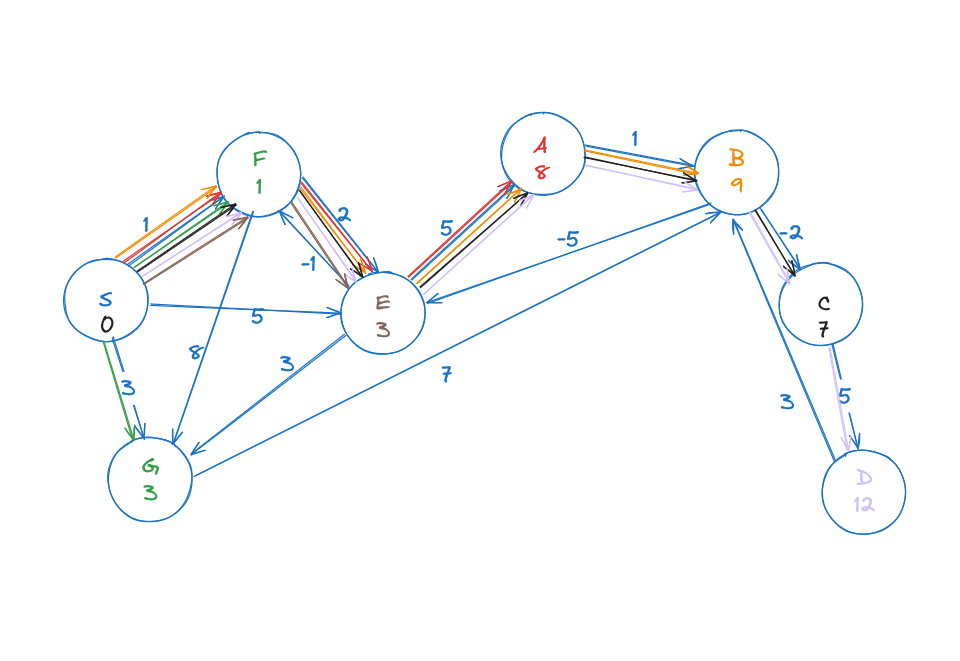

# Introduction

This is a section for finding weighted shortest path in a DAG.



## File structure

- `main.c` file contains the usage of Bellman-Ford algorithm during implementation.

- `utils.c` file contains the implementations for Bellman-Ford algorithm.

- `DAG_relaxation.c` file contains the implementations for DAG RELAXATION.

- `graph.c` file contains the implementations for graph.

- `dfs.c` file contains the implementations of depth first search.

- `dfs.h` file contains the header functions for dfs.

- `graph.h` file contains the header functions for graph.

- `DAG_relaxation.h` file contains the header functions for DAG RELAXATION.

- `utils.h` file contains the header functions for the depth first search.

- `Makefile` contains the command line configuration for the whole program. Uses [Clang 17.0.6](https://clang.llvm.org) compiler.

## Specification

- Implement an algorithm that can calculates the weighted shortest paths in a general graphs that might contains negative weights.

## Interface

- Bellman-Ford functions returns the single source shortest paths in quadratic time complexity $O(|V||E|)$.

You can compile the source code using the `Makefile`.

```bash
make
```
will compile and link all the source file to main executable.

Unlike python and go, we have to check memory leaks and other memory related issues using `valgrind`'s memcheck tool.

```bash
valgrind ./Bellman-Ford
```

or 

```bash
make valgrind
```

Running the machine code is like outputting the results of the implementations. You can check if your implementations are correct or not.

```bash
./Bellman-Ford
```

or 

```bash
make run
```
Depending on your os, and your computer, the commands might be a little different.

## Limitations

- Bellman-Ford function will exit the program if there's an negative weight cycle, which is not good if you want to know what vertices are in the negative weight cycle.

- To know which vertices are the negative weight cycle, we have to do graph duplications.

# References
Erik Demaine, Json Ku, Justin Solomon.MIT 6006 Introduction to algorithms. Spring2020. Massachusetts Institute of Technology: MIT OpenCouseWare, https://ocw.mit.edu/. License: Creative Commons BY-NC-SA.
