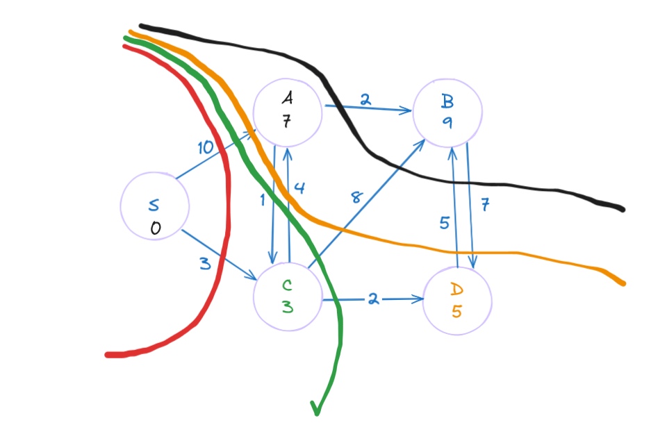

# Introduction

This is a section for finding weighted shortest paths(SSSP) in a general graph that doesn't contains negative weights using Dijkstra's algorithm.



## File structure

- `main.c` file contains the usage of Dijkstra's algorithm during implementation.

- `utils.c` file contains the implementations for Dijkstra's algorithm.

- `DAG_relaxation.c` file contains the implementations for DAG RELAXATION.

- `graph.c` file contains the implementations for graph.

- `graph.h` file contains the header functions for graph.

- `DAG_relaxation.h` file contains the header functions for DAG RELAXATION.

- `utils.h` file contains the header functions for the depth first search.

- `Makefile` contains the command line configuration for the whole program. Uses [Clang 17.0.6](https://clang.llvm.org) compiler.

## Specification

- Implement an algorithm that can calculates the weighted shortest paths in a general graphs that has only positive weight edges.

## Interface

- `Dijkstra` function finds the SSSP in quadratic time complexity $O(|V|^2)$ for both sparse or dense graph, using array implemtation of priority queue.

- `changable_PQ_array_build` function builds a new priority queue using the direct access array in linear time complexity $O(|V|)$.

- `changable_PQ_array_delete_min` function deletes the minimum in the given priority queue in linear time complexity $O(|V|)$.

- `changable_PQ_array_decrease_key` function decrease(replace) the distance estimates of the given vertex in the priority queue in constant time complexity $O(1)$.

- `free_PQ_array` function frees the memory that is allocated during the creation of the given priority queue in constant time complexity $O(1)$.

You can compile the source code using the `Makefile`.

```bash
make
```
will compile and link all the source file to main executable.

Unlike python and go, we have to check memory leaks and other memory related issues using `valgrind`'s memcheck tool.

```bash
valgrind ./Dijkstra
```

or 

```bash
make valgrind
```

Running the machine code is like outputting the results of the implementations. You can check if your implementations are correct or not.

```bash
./Dijkstra
```

or 

```bash
make run
```
Depending on your os, and your computer, the commands might be a little different.

## Limitations

- Dijkstra's algorithm will not work with graphs that contain negative weights.

# References
Erik Demaine, Json Ku, Justin Solomon.MIT 6006 Introduction to algorithms. Spring2020. Massachusetts Institute of Technology: MIT OpenCouseWare, https://ocw.mit.edu/. License: Creative Commons BY-NC-SA.
